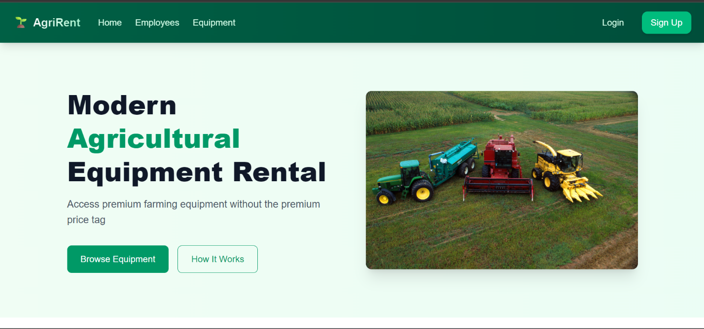
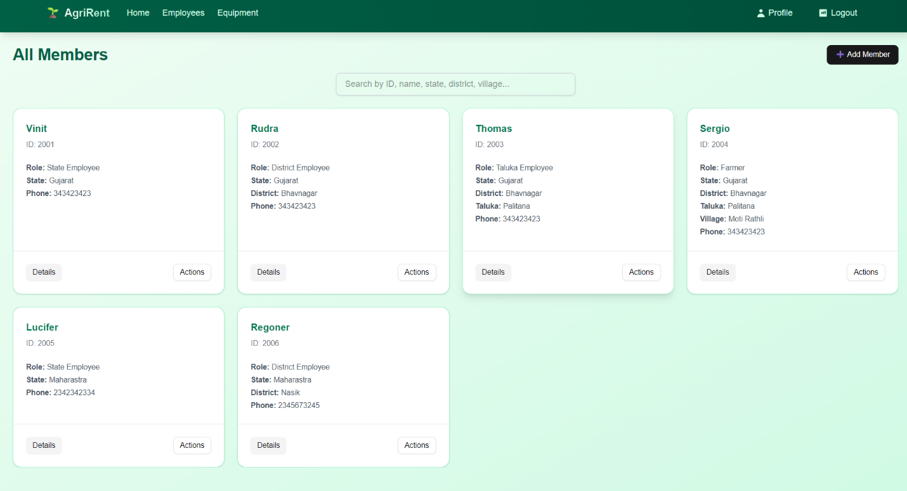
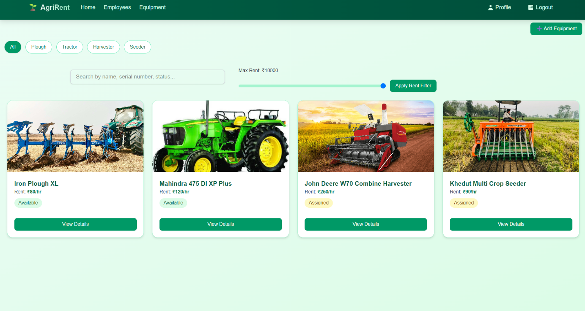
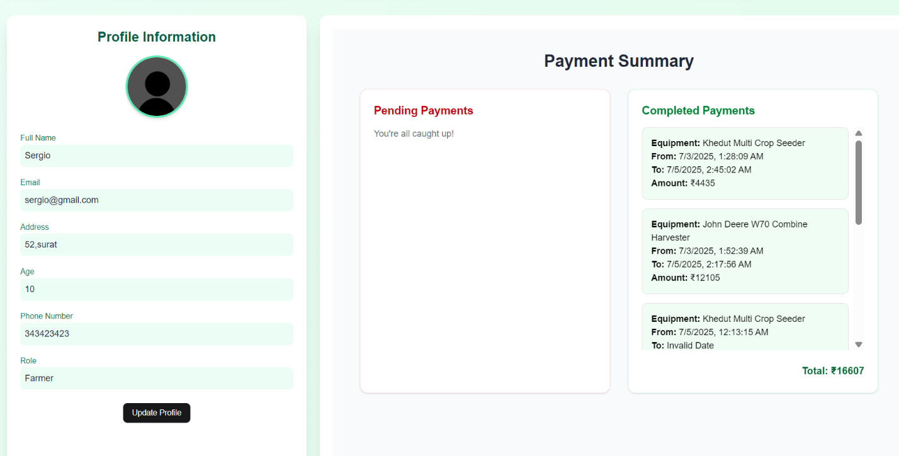

# 🚜 AgriRent – Farming Equipment Rental Platform

AgriRent is a full-stack web platform that allows farmers to **browse, rent, and pay** for agricultural equipment on an hourly basis. It features a role-based system to manage operations efficiently at **state, district, taluka**, and **farmer** levels.

---

## 🌐 Live Demo

> Coming Soon 

---

## 📸 Screenshots

<p align="center">
  <h3>Home Page</h3>
  
</p>
<p align="center">
  <h3>Admin All Employee Dashboard</h3>
  
</p>
<p align="center">
  <h3>All Equipment Page</h3>
  
</p>
<p align="center">
  <h3>Profile Page</h3>
  
</p>


---

## 📌 Features

- 🔐 **Role-Based Access Control** (Admin → State → District → Taluka → Farmer)
- 📄 Equipment listing and management
- 📅 Availability & rental duration management
- 💳 **Stripe integration** for hourly payments
- 🧾 Booking history and receipts
- 🔎 Filter and search by location, type, availability
- 🛠️ Admin-level equipment and user control

---

## 🚀 Tech Stack

### Frontend:

- **React.js** + **Vite**
- **ShadCN UI** + **Tailwind CSS**
- **Axios** for API communication

### Backend:

- **Node.js**, **Express.js** (ESModules)
- **MongoDB** (via Mongoose)
- **Stripe API** for payments

---

## 🏗️ Project Structure

```
AgriRent/
├── frontend/          # Frontend React app
└── backend/          # Backend Express app
```

---

## 🧠 How to Run Locally

### Backend

```bash
cd backend
npm install
npm run dev
```

### Frontend

```bash
cd frontend
npm install
npm run dev
```

---

## 🔐 Authentication & Authorization

Custom middleware ensures secure access:

- Only authorized users can perform specific actions
- Protected routes for each role (e.g. `adminProtect`, `talukaProtect`)

---

## 📦 Future Enhancements

- 📱 Mobile-responsive UI
- 🔔 Notification system
- 🧾 Invoice generation
- 🌐 Multi-language support

---

## 🧑‍💻 Author

- **Vinit Saspara** – [GitHub](https://github.com/vinitsaspara) | [LinkedIn](https://linkedin.com/in/vinit-saspara-997b91294/)

---

## ⭐ Star this repo if you find it helpful!
